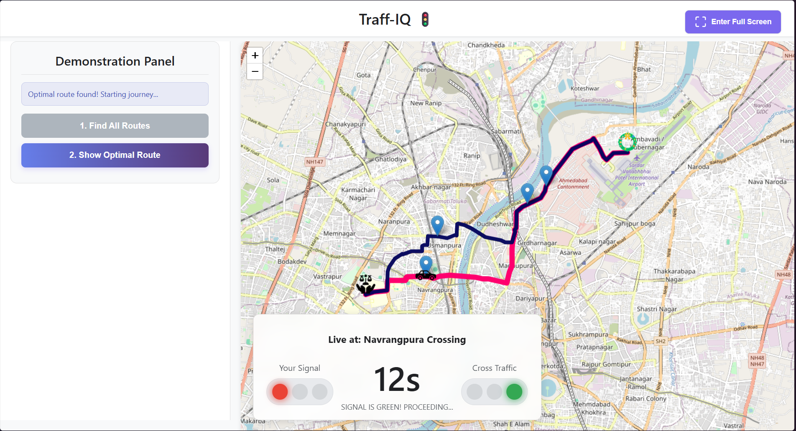
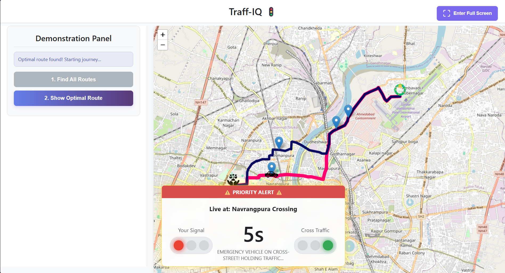
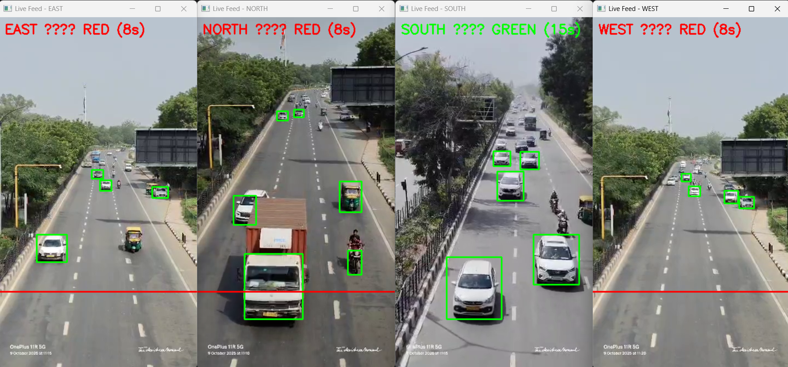
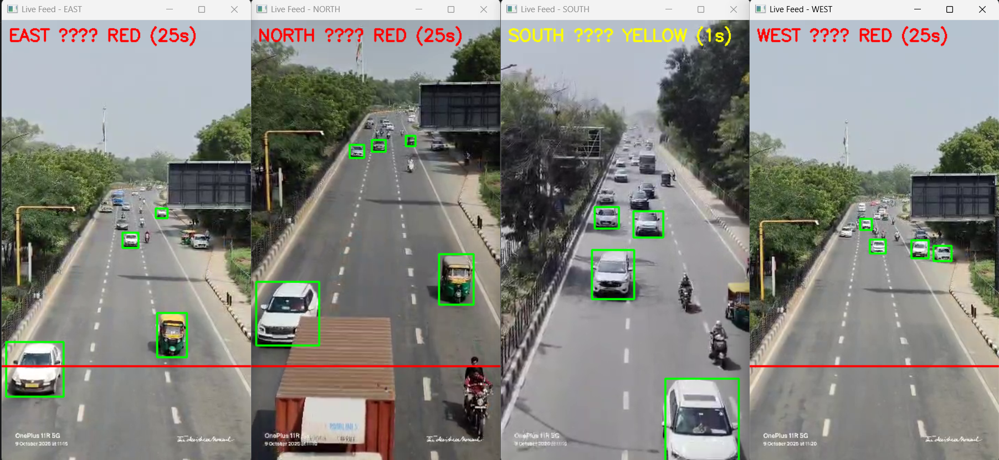

# 🚦 TRAFF-IQ — AI-Powered Intelligent Traffic Management System

> 🏆 Finalist | Hackatron, IIIT Gwalior

TRAFF-IQ is an AI-powered adaptive traffic management system designed to optimize traffic flow at real-world intersections. Unlike traditional timer-based traffic signals, it leverages **YOLOv8**, **OpenCV**, and real-time computer vision to monitor traffic density, detect emergency vehicles, and identify traffic violations.

The system dynamically adjusts traffic signal timings based on lane-wise congestion while prioritizing ambulances, fire trucks, and police vehicles to reduce emergency response time. A live monitoring dashboard provides complete visibility into intersection activity, and Arduino integration enables direct control of physical traffic signals.

---

## 📸 Project Preview

<p align="center">
    
</p>

---

# ✨ Features

### 🚑 Emergency Vehicle Detection

- Detects ambulances, fire trucks, and police vehicles using YOLOv8.
- Automatically prioritizes emergency vehicles by controlling traffic signals.
- Achieved approximately **90% detection accuracy**.

<p align="center">
    
</p>

---

### 🚗 Adaptive Traffic Density Estimation

- Counts vehicles lane-wise using computer vision.
- Dynamically allocates green signal duration based on traffic density.
- Achieved approximately **85% detection accuracy**.

<p align="center">
    
</p>

---

### 🚨 Traffic Violation Detection

- Detects red-light violations in real time.
- Stores every violation with timestamps for monitoring and analytics.

<p align="center">
    
</p>

---

### 📊 Live Monitoring Dashboard

- Built using **React**, **Node.js**, and **Socket.IO**.
- Displays:
  - Live traffic density
  - Current signal status
  - Emergency vehicle alerts
  - Violation logs
  - System statistics

---

### 🔌 Hardware Integration

- Communicates with an Arduino using Serial Communication.
- Controls physical traffic signals based on AI predictions.
- Demonstrates seamless software-hardware integration.

---

# 🏗 System Architecture

```
Traffic Camera
      │
      ▼
YOLOv8 + OpenCV
      │
      ├───────────────┐
      │               │
      ▼               ▼
Traffic Density   Emergency Detection
      │               │
      └──────┬────────┘
             ▼
      Signal Decision Engine
             │
     ┌───────┴────────┐
     ▼                ▼
Arduino         React Dashboard
Traffic Lights   (Socket.IO)
```

---

# 🛠 Tech Stack

| Category | Technologies |
|----------|--------------|
| AI & Computer Vision | Python, YOLOv8, OpenCV |
| Detection Server | Flask, Flask-SocketIO |
| Backend | Node.js, Express.js, Socket.IO |
| Frontend | React.js |
| Database | MongoDB |
| Hardware | Arduino UNO (C++) |

---

# 🚀 Installation

### Clone the Repository

```bash
git clone https://github.com/hck-anmol/TRAFF-IQ.git
cd TRAFF-IQ
```

### Install Python Dependencies

```bash
pip install -r requirements.txt
```

### Start the Detection Server

```bash
python app.py
```

Configure the video source and serial port inside `config.py`.

---

### Start Backend

```bash
cd dashboard
npm install
npm start
```

---

### Start Frontend

```bash
cd client
npm install
npm run dev
```

The application runs at:

```
http://localhost:5173
```

---

### Hardware Setup (Optional)

1. Open `arduino/signal_control.ino`
2. Upload the sketch using Arduino IDE.
3. Update the COM port in `config.py`.

---

# 📂 Project Structure

```
TRAFF-IQ/
│
├── client/                 # React Frontend
├── dashboard/              # Express + Socket.IO Backend
├── density/                # Traffic Density Module
├── emergency/              # Emergency Detection Module
├── web/                    # Dashboard Assets
├── app.py
├── config.py
├── requirements.txt
└── README.md
```

---

# 🎯 Highlights

- AI-powered adaptive traffic signal control
- Real-time emergency vehicle prioritization
- Intelligent traffic density estimation
- Traffic violation detection
- Live monitoring dashboard
- Arduino-based traffic signal automation
- Finalist at **Hackatron, IIIT Gwalior**

---

# 🔮 Future Improvements

- Multi-intersection coordination
- Predictive traffic analysis using historical data
- Edge AI deployment using NVIDIA Jetson
- Cloud-based monitoring and analytics
- Automatic incident detection

---

# 👨‍💻 Team

Built during **Hackatron, IIIT Gwalior** by **Team Entropy**.

---

# 📜 License

This project is intended for educational and research purposes.